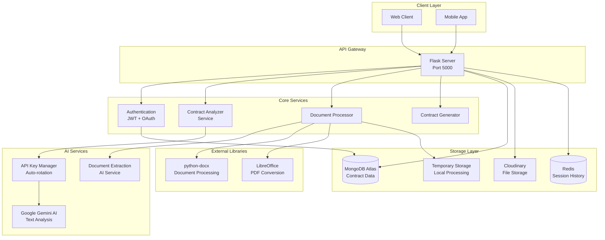

# SharAI-Architecture-Docs

# Shariaa Contract Analyzer Backend Documentation

## Table of Contents

1. [System Overview](#system-overview)
2. [Architecture](#architecture)
3. [Technology Stack](#technology-stack)
4. [Core Components](#core-components)
5. [API Endpoints](#api-endpoints)
6. [Database Schema](#database-schema)
7. [File Processing Pipeline](#file-processing-pipeline)
8. [Configuration Management](#configuration-management)
9. [Error Handling & Logging](#error-handling--logging)
10. [Security Considerations](#security-considerations)
11. [Deployment Architecture](#deployment-architecture)

## System Overview

The Shariaa Contract Analyzer is a sophisticated backend system designed to analyze legal contracts for compliance with Islamic law (Sharia) principles, specifically following AAOIFI (Accounting and Auditing Organization for Islamic Financial Institutions) standards. The system leverages advanced AI capabilities through Google's Generative AI models to provide intelligent contract analysis, modification suggestions, and expert review capabilities.

### Key Features

- **Multi-format Contract Processing**: Supports DOCX, PDF, and TXT formats
- **User Authentication**: JWT-based auth with refresh tokens, Google OAuth, bcrypt password hashing
- **Session Persistence**: Redis-backed conversation history — AI remembers context across requests and server restarts
- **Deep AAOIFI Integration**:
    - **Massive Context Window**: Supports up to **1,000,000 characters** of AAOIFI standards text per analysis
    - **Rich Metadata**: Injects full standard details including specific sections, keywords, and aliases
    - **Smart Routing**: Dedicated AI Router identifies relevant standards with strict ID enforcement
- **API Key Rotation**: Automatic rotation on quota exhaustion (429 errors) via `APIKeyManager`
- **Interactive User Consultation**: Real-time Q&A about contract terms (with AAOIFI reference grounding)
- **Expert Review System**: Professional expert feedback integration
- **Contract Modification**: Automated generation of compliant contract versions
- **Document Management**: Cloud-based storage with Cloudinary integration
- **Multi-language Support**: Primarily Arabic with English support

> **📌 File Search Architecture**: File Search (AAOIFI reference retrieval) is used **only** in post-analysis interactions (`/interact`, `/review_modification`). Contract analysis uses a **direct injection** method where the Router selects standards and the full text is embedded in the prompt.

## Architecture

### High-Level Architecture Diagram



## Technology Stack

### Core Framework
| Library | Version | Purpose |
|---------|---------|---------|
| Flask | >=3.0.0 | Python web framework for RESTful API |
| Flask-CORS | >=4.0.0 | Cross-Origin Resource Sharing |
| gunicorn | >=21.0.0 | Production WSGI server |
| Werkzeug | >=3.0.0 | WSGI utilities |

### AI & Machine Learning
| Library | Version | Purpose |
|---------|---------|---------|
| google-genai | >=1.50.0 | Gemini AI SDK (new unified SDK) |

### Authentication & Security
| Library | Version | Purpose |
|---------|---------|---------|
| PyJWT | >=2.0.0 | JWT token generation/validation |
| bcrypt | >=4.0.0 | Password hashing |
| google-auth | - | Google OAuth token verification |

### Document Processing
| Library | Version | Purpose |
|---------|---------|---------|
| python-docx | >=1.0.0 | Microsoft Word document manipulation |
| LibreOffice | System | PDF conversion (headless mode) |
| unidecode | >=1.3.0 | Unicode transliteration for filenames |
| langdetect | >=1.0.9 | Automatic language detection |

### Database & Storage
| Library | Version | Purpose |
|---------|---------|---------|
| pymongo[srv] | >=4.0.0 | MongoDB Python driver with SRV |
| dnspython | >=2.0.0 | DNS resolution for MongoDB Atlas |
| cloudinary | >=1.40.0 | Cloud-based file storage |
| redis | >=5.0.0 | Session history persistence (L2 cache) |

### Utilities
| Library | Version | Purpose |
|---------|---------|---------|
| requests | >=2.31.0 | HTTP client for external API calls |
| python-dotenv | >=1.0.0 | Environment variable loading |
| pytest | >=7.0.0 | Testing framework |

## Core Components

### 1. Application Core (`run.py` & `app/`)
The system follows a factory pattern. `run.py` initializes the Flask app created by `app.create_app()` and runs `cleanup_old_traces()` at startup to automatically delete trace files older than 7 days.

### 2. Authentication Service (`app/services/auth_service.py`)
Handles user authentication with JWT tokens, refresh token rotation, and Google OAuth.

**Key Features:**
- User registration with bcrypt password hashing
- Email/password login returning **access token (7 days)** + **refresh token (30 days)**
- Google OAuth login support
- **Refresh token rotation**: every refresh issues a new refresh token and invalidates the old one
- **Real server-side logout**: `POST /api/auth/logout` deletes the refresh token from MongoDB — the session is truly revoked
- Password reset with secure tokens
- Profile management

### 2b. Redis Service (`app/services/redis_service.py`)
Manages persistent chat history storage for AI sessions.

**Key Features:**
- Stores conversation history (user questions + AI answers) in Redis with TTL
- L1/L2 caching architecture: in-process dict (fast) → Redis (persistent across restarts)
- Graceful fallback if Redis is unavailable — session continues with empty history
- Default TTL: 3600 seconds (configurable via `SESSION_HISTORY_TTL`)

### 3. AI Service (`app/services/ai_service.py`)
Manages all LLM interactions with automatic API key rotation.

**Key Features:**
- **APIKeyManager**: Automatic rotation on 429 quota errors
- Multiple API keys support via `GEMINI_API_KEYS`
- Thinking Mode configuration (up to 24,576 tokens)
- Structured JSON output with Pydantic schemas
- Contract generation with specialized prompts

### 4. Document Processor (`app/services/document_processor.py`)
Robust engine for document manipulation, formatting preservation, and PDF conversion.

**Core Capabilities:**
- **Text Extraction**: Uses `python-docx` for structured markdown and Gemini for PDF/OCR
- **AI Orchestration**: Generates complex marked contracts using semantic tags (`[[RED:...]]`, `[[GREEN:...]]`)
- **Formatting Preservation**: Supports bold, italics, tables, and RTL Arabic layouts
- **PDF Conversion**: Headless LibreOffice integration with automated Cloudinary hosting

### 5. AAOIFI Service (`app/services/aaoifi_service.py`)
Loads and manages AAOIFI standards from MongoDB.

**Key Features:**
- Standards sync from filesystem to MongoDB
- In-memory caching for performance
- Batch loading of multiple standards
- Context building for AI prompts (up to 600k characters)

## API Endpoints

### Authentication Endpoints (`/api/auth`)
| Method | Endpoint | Purpose |
|--------|----------|---------|
| POST | `/api/auth/register` | User registration |
| POST | `/api/auth/login` | Email/password login → returns `token` + `refresh_token` |
| POST | `/api/auth/google-login` | Google OAuth login → returns `token` + `refresh_token` |
| POST | `/api/auth/refresh` | Issue new access token using refresh token (token rotation) |
| POST | `/api/auth/logout` | Real server-side logout — revokes refresh token in MongoDB |
| POST | `/api/auth/forgot-password` | Request password reset |
| POST | `/api/auth/reset-password` | Reset password |
| PATCH | `/api/auth/profile` | Update profile |
| GET | `/api/auth/me` | Get current user |

### Contract Analysis Endpoints
| Method | Endpoint | Purpose |
|--------|----------|---------|
| POST | `/analyze` | Upload and analyze contract |
| GET | `/sessions` | List recent sessions |
| GET | `/session/<session_id>` | Get session details |
| GET | `/terms/<session_id>` | Get analyzed terms |

### Contract Generation Endpoints
| Method | Endpoint | Purpose |
|--------|----------|---------|
| POST | `/generate_modified_contract` | Generate clean modified version |
| POST | `/generate_marked_contract` | Generate marked version with highlights |
| GET | `/preview_contract/<id>/<type>` | PDF preview |
| GET | `/download_pdf_preview/<id>/<type>` | PDF download |

### Interaction Endpoints
| Method | Endpoint | Purpose |
|--------|----------|---------|
| POST | `/interact` | Q&A consultation (FileSearch enabled) |
| POST | `/review_modification` | Review user modifications |
| POST | `/confirm_modification` | Confirm modification |

### Admin Endpoints (`/admin`)
| Method | Endpoint | Purpose |
|--------|----------|---------|
| POST | `/admin/sync_aaoifi` | Sync AAOIFI standards |
| GET | `/admin/aaoifi_status` | Check sync status |
| GET | `/admin/traces` | List request traces |

## Database Schema

### MongoDB Collections

#### 1. `users` Collection
```javascript
{
    _id: ObjectId,
    email: String,
    password: String,          // bcrypt hash
    name: String,
    created_at: Date,
    credit_balance: Number,
    provider: String,          // "google" or null
    refresh_token: String,     // 30-day refresh token (plain text)
    refresh_token_expiry: Date,// expiry of refresh token
    reset_token: String,
    reset_token_expiry: Date
}
```

#### 2. `contracts` Collection
```javascript
{
    _id: ObjectId,
    session_id: String,
    user_id: String,
    original_filename: String,
    original_cloudinary_info: Object,
    original_format: String,
    original_contract_markdown: String,
    detected_contract_language: String,
    analysis_timestamp: Date,
    confirmed_terms: Object,
    interactions: Array,
    modified_contract_info: Object,
    marked_contract_info: Object
}
```

#### 3. `terms` Collection
```javascript
{
    _id: ObjectId,
    session_id: String,
    term_id: String,
    term_text: String,
    compliance_status: String,  // "compliant", "warning", "non_compliant"
    sharia_issue: String,
    reference_number: String,
    modified_term: String,
    is_confirmed_by_user: Boolean,
    confirmed_modified_text: String
}
```

## Configuration Management

### Environment Variables

```env
# AI Service (with rotation support)
GEMINI_API_KEY=AIzaSy...              # Primary Gemini API key
GEMINI_API_KEYS=key1,key2,key3        # Multiple keys for rotation
MODEL_NAME=gemini-2.5-flash

# File Search (Optional)
GEMINI_FILE_SEARCH_API_KEY=AIzaSy...
FILE_SEARCH_STORE_ID=fileSearchStores/...

# Database
MONGO_URI=mongodb+srv://...

# Session History (Redis)
REDIS_URL=redis://localhost:6379/0
SESSION_HISTORY_TTL=3600              # Seconds before chat history expires

# Authentication
JWT_SECRET=your-jwt-secret
GOOGLE_CLIENT_ID=...

# Cloud Storage
CLOUDINARY_CLOUD_NAME=...
CLOUDINARY_API_KEY=...
CLOUDINARY_API_SECRET=...

# Document Processing
LIBREOFFICE_PATH=/path/to/soffice

# Thinking Mode
ENABLE_THINKING_MODE=True
THINKING_BUDGET=24576
```

### Cloudinary Folder Structure

```
shariaa_analyzer_uploads/
├── {session_id}/
    ├── original_contracts/
    ├── analysis_results_json/
    ├── modified_contracts/
    ├── marked_contracts/
    └── pdf_previews/
```

## Error Handling & Logging

### Error Categories

1. **Authentication Errors** (401, 403)
   - Invalid/expired JWT tokens
   - Missing authorization headers

2. **Input Validation Errors** (400)
   - Invalid file formats
   - Missing required parameters

3. **Processing Errors** (500)
   - AI service failures
   - Document conversion issues

4. **External Service Errors** (503)
   - Database connectivity issues
   - Cloudinary upload failures

### Error Response Format

```json
{
    "error": "Descriptive error message",
    "timestamp": "2026-01-26T15:00:00Z"
}
```

## Security Considerations

### Authentication & Authorization

1. **JWT Access Token**
   - **7-day** expiration (renewed silently via refresh token)
   - HS256 signing algorithm
   - Raises on generation failure — never silently issues a garbage token

2. **Refresh Token System**
   - **30-day** opaque token stored in MongoDB
   - **Token rotation**: each `POST /refresh` call issues a new refresh token and invalidates the old one
   - **Real logout**: `POST /api/auth/logout` deletes the refresh token from DB — stolen tokens cannot be reused after logout

3. **Password Security**
   - bcrypt hashing with salt
   - Secure password reset tokens (1-hour expiry)

4. **Google OAuth**
   - ID token verification via Google library
   - Auto user creation on first OAuth login

## Caching Architecture

The system uses a **three-tier caching strategy**:

```
┌──────────────────────────────────────────────────────────────┐
│  Tier 1 — Python Process Memory (microseconds)              │
│  What: AAOIFI standards JSON + active chat sessions         │
│  Where: Module-level dicts in aaoifi_service.py, sessions.py│
│  Eviction: Server restart                                   │
└───────────────────────┬──────────────────────────────────────┘
                        │ miss
┌───────────────────────▼──────────────────────────────────────┐
│  Tier 2 — Redis (milliseconds)                              │
│  What: Chat conversation history (user Q&A turns)          │
│  Where: redis_service.py, key: session_history:{session_id} │
│  Eviction: TTL = SESSION_HISTORY_TTL (default 3600s)        │
│  Fallback: If Redis unreachable → empty history (no crash)  │
└───────────────────────┬──────────────────────────────────────┘
                        │ miss
┌───────────────────────▼──────────────────────────────────────┐
│  Tier 3 — MongoDB (milliseconds)                            │
│  What: Contracts, terms, users, AAOIFI standards            │
│  Where: database.py + aaoifi_service.py                     │
│  Eviction: Never (persistent)                               │
└──────────────────────────────────────────────────────────────┘
```

**Why this design:**
- AAOIFI standards (static data, ~126K chars each) live in process memory to avoid repeated MongoDB round-trips
- Chat history (dynamic, per-user) lives in Redis so it survives server restarts and works across Gunicorn workers
- MongoDB is the source of truth for everything that must survive indefinitely


### Input Validation

1. **File Upload Security**
   - File type validation (DOCX, PDF, TXT)
   - Size limitations (16MB max)
   - Secure filename generation

2. **Data Sanitization**
   - MongoDB parameterized queries
   - XSS prevention in responses

## Deployment Architecture

### Procfile Configuration

```
web: gunicorn run:app
```

### Production Considerations

1. **Scalability**
   - Horizontal scaling via multiple workers
   - API key rotation for quota management

2. **Availability**
   - Health check endpoint (`/health`)
   - Graceful error handling

### Dependencies Management

```txt
Flask>=3.0.0
Flask-CORS>=4.0.0
gunicorn>=21.0.0
pymongo[srv]>=4.0.0
google-genai>=1.50.0
python-docx>=1.0.0
cloudinary>=1.40.0
PyJWT>=2.0.0
bcrypt>=4.0.0
langdetect>=1.0.9
unidecode>=1.3.0
python-dotenv>=1.0.0
```

## Documentation Links

- **[README](README.md)**: Setup and quick start
- **[API Routes](ROUTES_DOCUMENTATION.md)**: Detailed API reference
- **[Services](SERVICES_DOCUMENTATION.md)**: Core services documentation
- **[Data Flow](DATA_FLOW.md)**: Flow diagrams
- **[Technical Diagrams](TECHNICAL_DIAGRAMS.md)**: Architecture diagrams
- **[Payloads](PAYLOADS.md)**: Request/Response examples
